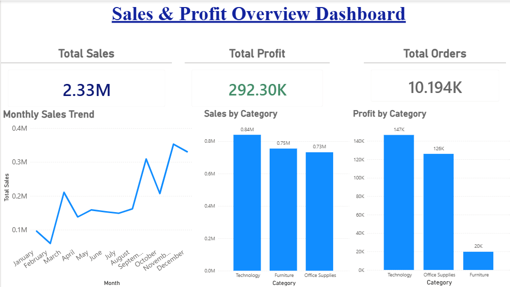
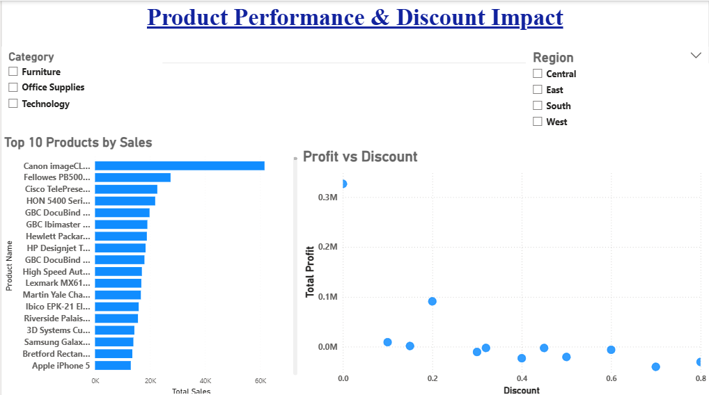

📊Sales & Profit Analysis Dashboard
## Dashboard Preview

### Overview (Dashboard)

### Detailed Analysis

📌 Project Overview

This project analyzes sales data to uncover key insights related to revenue, profitability, and discount impact.
Data cleaning and analysis were performed using Python, and an interactive dashboard was built using Power BI.

🛠 Tools & Technologies
Python (Pandas, Matplotlib)
Power BI
GitHub

📁 Project Files
Sales_Dashboard.pbix → Power BI dashboard
cleaned_superstore.csv → Dataset
Sales and Business Analysis.ipynb → Data cleaning & analysis

📈 Dashboard Features
KPI Cards (Total Sales, Profit, Orders)
Monthly Sales Trend
Sales by Category
Top 10 Products by Sales
Profit vs Discount Analysis

🔍 Key Insights
Technology generates the highest profit
Furniture shows low profitability despite decent sales
Higher discounts lead to lower or negative profits
A small number of products contribute significantly to revenue

💡 Business Recommendations
Optimize discount strategy to improve profitability
Focus on high-margin categories like Technology
Re-evaluate pricing for low-profit categories

🚀 Conclusion

This project demonstrates end-to-end data analysis from cleaning to visualization, helping in data-driven decision making.
